  

  
  
  
  

  

### 🚀 What I'm building

  
  
  

### 🧠 Featured engineering

| | |
|---|---|
| 🔎 **[AI Engineering Portfolio](https://github.com/Zalamancer/ai-engineering-portfolio)** | Hybrid-search RAG (hit@5 **58% → 82%**), an LLM regression gate that blocks bad prompts in CI (**85% → 97.5%**, p = 0.002), LangGraph multi-agent system with exactly-once side effects |
| 🗳️ **Quorum** private | Raft in Go, **40,000+** histories verified linearizable under chaos testing, **6.4×** throughput with group commit |
| 🎙️ **[People Connect](https://github.com/Zalamancer/peoplewallet)** | Voice note → structured contact (Deepgram + Claude), shipped to TestFlight |
| 🎢 **3D & games** | A 3D tycoon world tuned for a 2019 iPad, a [roller coaster builder](https://github.com/Zalamancer/roller-coaster-builder), a [web 3D editor](https://github.com/Zalamancer/3D-Workspace-and-Editor), Roblox games since 2021 |

### 🛠️ Stack

  

### 🐍 Contributions

  <picture>
    <source media="(prefers-color-scheme: dark)" srcset="https://raw.githubusercontent.com/Zalamancer/Zalamancer/output/snake-dark.svg" />
    
  </picture>

Most of my 100+ projects live in private repos. Happy to walk through any of them.

